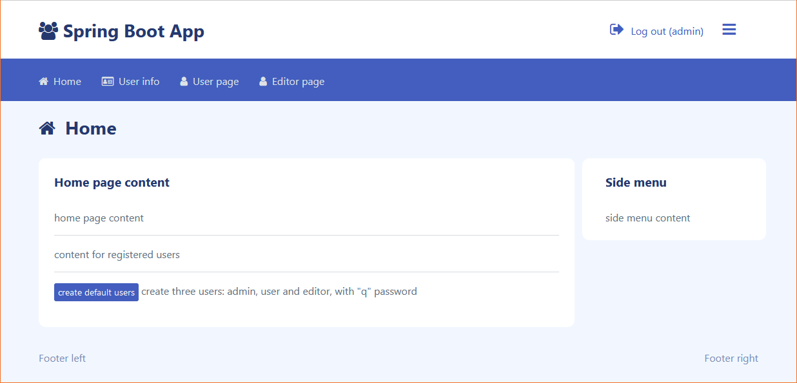

[](#title)

### About
Simple project with spring-security authorization.

* user with 3 roles: user, editor and admin
* custom: UserDetailService, PasswordEncoder and AuthenticationProvider
* login and registration
* custom error controller
* thymeleaf layout dialect
* mysql database for store users
* bootstrap 5 theme

### Create default users
On home page click button: create default users

### Setup
* Create mysql database for project
* Open src/main/resources/application.properties and set:
```bash
- server.port
- spring.datasource.url as "jdbc:mysql://ip:port/dbname"
- spring.datasource.username
- spring.datasource.password
```

### Run
```bash
mvnw clean package
java -jar target\spring-security-example-0.0.1.jar

or create application with main class "springboot.v2.security.example.WebApplication"
```